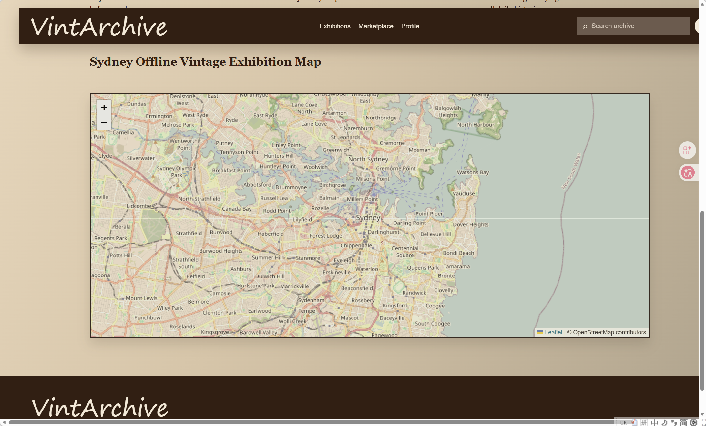

As the project developed further, I began exploring how external APIs could extend the functionality of the platform. One key insight identified during earlier user research was that users strongly preferred local, in-person transactions, as they were perceived to be safer and more trustworthy than remote exchanges. This led me to investigate how map-based APIs could support local trading interactions within Sydney.

According to this week’s lecture, APIs (Application Programming Interfaces) allow applications to communicate with external services and retrieve data or functionality without building everything from scratch. Rather than developing a custom map system independently, APIs allow developers to integrate existing services such as maps, geolocation, and routing into a web application. This makes development more efficient while also introducing real-world technical considerations such as authentication, quotas, and security.

To experiment with this idea, I used **Leaflet.js** together with **OpenStreetMap** to prototype a Sydney-based exhibition map for the VintArchive platform.

我在exhibition部分加入地图，地图中心定位在悉尼市中心坐标