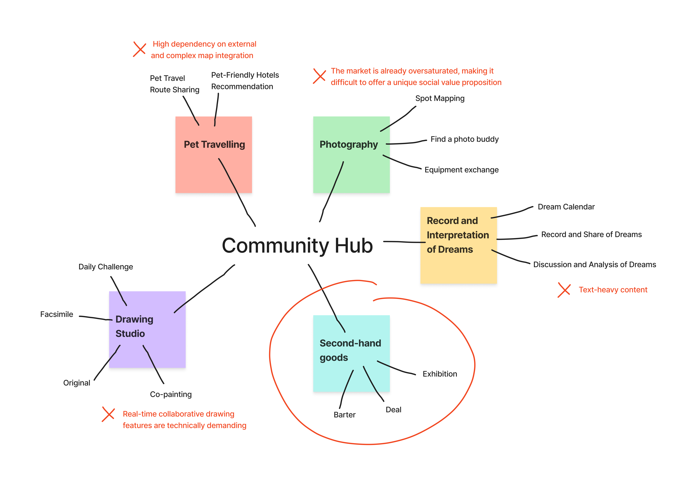

After reading the Design Brief 2026, I recognized that the primary mandate is to architect a bespoke 'community hub'—a digital ecosystem where individuals with shared passions can converge and cultivate profound social synergy. To explore the multifaceted possibilities of this mandate, I initiated a comprehensive brainstorming session. I listed all topics what I am interested in first, such as photographing, drawing,travelling, pets. And then I started a brainstom to go deeper each topic to make it more interesting and more business values. I analysized the main functions, 优势和缺点 of each topic to 进行评估. 我喜欢Both 梦境记录和解读和旧物博物馆的主题，二手平台更具有商业价值，而梦境描述多为长文本，视觉上容易显得枯燥，所以我选择做二手平台。
