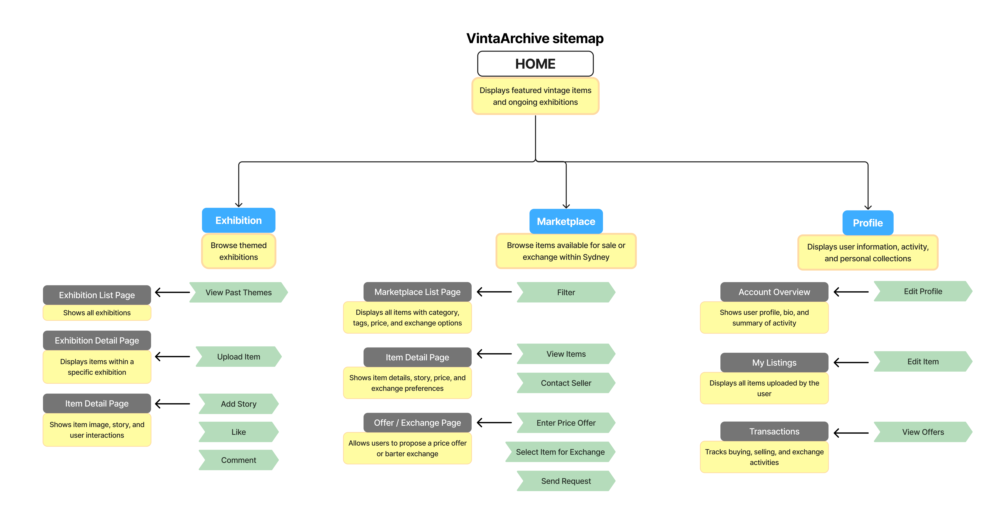

To better understand user needs and inform the main functions of this website, I conducted online research using platforms such as Reddit and Youtube. Through analysing real user experiences, I identified several key insights that directly shaped our design decisions.

1.	 Many users expressed that they lack an appropriate way to display and meaningfully present their collections. Vintage items are often accumulated but remain underutilised, with no dedicated space for exhibition or storytelling. In response, our platform introduces two primary functions: exhibition and marketplace. The exhibition feature allows the platform to host themed events, such as “Vintage Camera Exhibition” or “1960s Collection.” Users can upload their vintage items and share the stories behind them, transforming personal collections into curated digital exhibits. At the same time, other users can browse, like, save, and comment on these items, encouraging interaction and community engagement.

2. Users frequently reported frustration with repetitive and low-quality communication when selling second-hand goods. Many sellers receive numerous messages asking basic questions, which significantly reduces efficiency. To address this issue, the marketplace feature incorporates structured item listings, including clear categorisation, description, tagging, and pricing. This helps reduce unnecessary communication by providing essential information upfront.

3. Trust and safety emerged as major concerns. Existing platforms such as eBay, Facebook Marketplace, and Depop are often associated with scams, unreliable buyers, and poor communication. Many users indicated a strong preference for local, in-person transactions, as these are perceived to be safer and more trustworthy. Therefore, to enhance both feasibility and user trust, our platform intentionally **limits its scope to Sydney**, supporting local exchanges and reducing the risks associated with remote transactions.

To organise these functionalities, a sitemap was developed to define the structure of the application and its navigation logic.

The sitemap is organised into three primary sections: Exhibition, Marketplace and Profile.

- The **Exhibition** section focuses on storytelling and curated collections.
- The **Marketplace** section supports buying and bartering of items.
- The **Profile** section integrates both personal expression and transaction management.

Due to the limited timeframe and technical constraints of the project, the Exhibition feature is prioritised as the core functionality. This decision is justified by its strong alignment with user needs, its uniqueness compared to existing platforms, and its feasibility for implementation within the available resources. In contrast, the Marketplace is intentionally scoped down to avoid unnecessary complexity while still supporting basic functionality.

