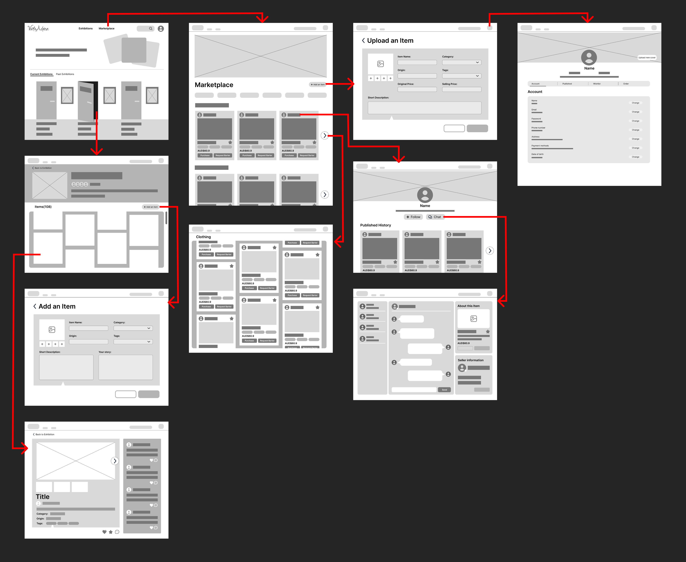
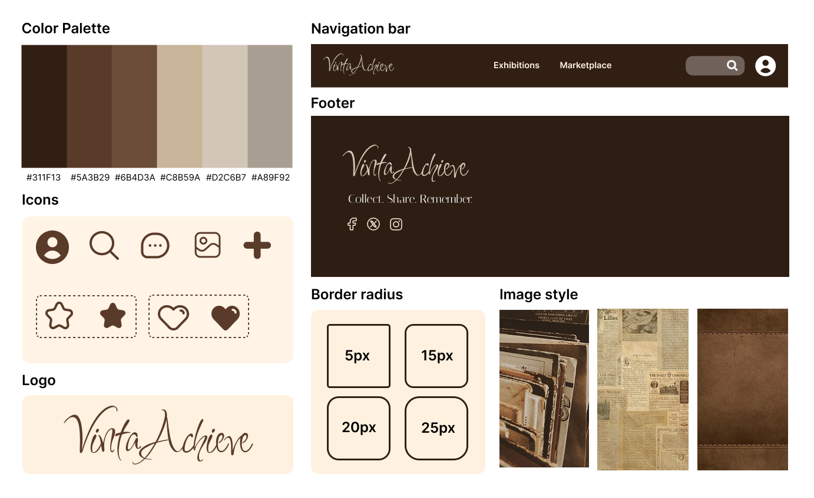

Based on the sitemap developed in the previous stage, a **user flow** was created to map how users interact with the system and complete key tasks. This helped clarify not only the sequence of actions, but also how different pages are connected, ultimately informing the layout and structure of the interface.

The user flow focuses on three main sections: Exhibition, Marketplace, and Profile. To further translate these flows into interface structure, **wireframes** were developed to visualise the layout and hierarchy of each page.

In the Exhibition section, I designed an interaction inspired by physical gallery spaces. Each exhibition is represented as a **door**, with the theme displayed on a sign and a preview image shown as a framed poster. When users hover over a door, it slightly opens, creating a subtle and engaging visual cue. Clicking the door allows users to enter a themed exhibition.

Inside the exhibition, the top section presents key information, including a cover image, title, number of participants, and a short description. Below this, items are displayed in a gallery-style layout. Users can click on any item to view detailed information, including images and associated stories. Additionally, users can contribute by clicking “Add an item,” uploading an image, and entering relevant details. This interaction directly supports the storytelling-focused concept of the platform.

The Marketplace section is designed to support efficient browsing and basic transactions. Users can search for items or explore them through categories. Each item card presents essential information to reduce unnecessary communication. By selecting an item, users can view detailed information, navigate to the seller’s profile, and initiate contact through a messaging function. Users can also upload their own items for sale or exchange. However, this section is intentionally simplified to maintain feasibility and avoid overcomplicating the system.

The Profile section allows users to manage their personal information and activity. Users can edit their profile, view items they have uploaded, and access saved or previously interacted items. This section integrates both expressive and functional aspects of the platform, supporting personal curation as well as basic management tasks.

The visual direction is informed by a vintage-inspired **mood board**. A brown colour palette was chosen to evoke warmth, nostalgia, and a sense of history, aligning with the concept of vintage collections. The logo uses a handwritten-style typeface called Inspiration to create a more personal and expressive tone.

From a technical perspective, the wireframes were also developed with implementation in mind. Repeated components such as the navigation bar, footer, and item cards were identified as reusable elements. These will be implemented as modular blocks to improve development efficiency and maintain consistency across the interface.

Overall, the user flow and wireframes demonstrate a clear connection between user needs, design decisions, and technical feasibility. The structure prioritises the exhibition feature while ensuring that supporting features remain achievable within the scope of the project.

